# Practicas de clase
Todas las practicas echas en clase con Arduino

# Proyecto: LED Básico

## Descripción:
El programa enciende un LED conectado al pin 13 de forma continua.

## Componentes Utilizados:
- Arduino.
- LED conectado al pin 13.
- Resistencia de 220Ω.

# Diagrama:
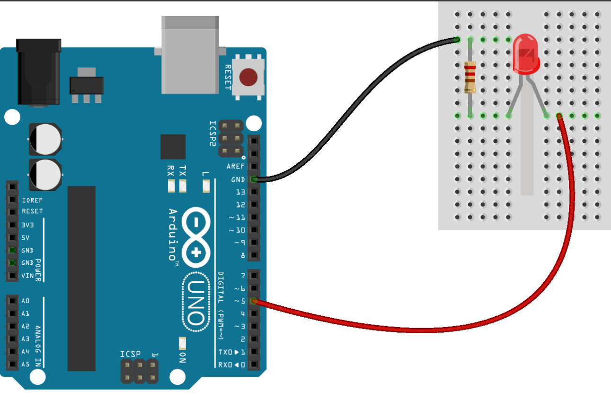

# Proyecto: Serie de LEDs

## Descripción:
Controla tres LEDs (verde, amarillo y rojo) en una secuencia con retardos definidos para simular un flujo continuo de encendido y apagado.

## Componentes Utilizados:
- Arduino.
- LEDs (verde, amarillo, rojo) conectados a los pines 13, 12 y 8.
- Resistencias de 220Ω para cada LED.

# Diagrama:
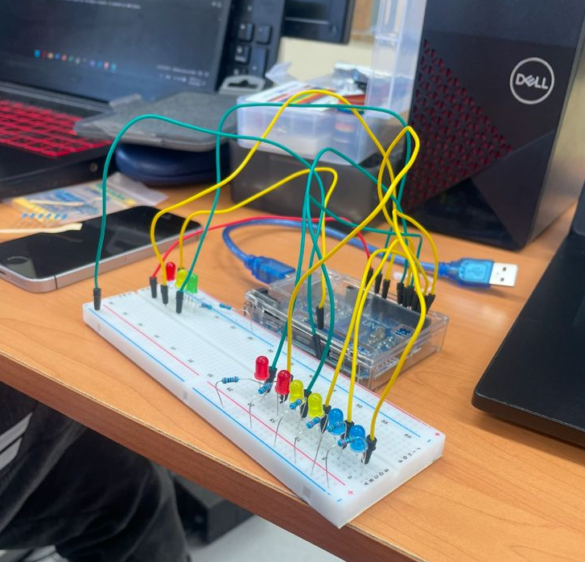

# Proyecto:  LED RGB

## Descripción:
El programa controla un LED RGB utilizando tres pines digitales, se asignan valores específicos a los colores rojo, verde y azul para lograr una mezcla de colores personalizada, los colores pueden cambiarse manualmente descomentando secciones del código.

## Componentes Utilizados:
- Arduino.
- LED RGB con pines para rojo, verde y azul.
- Resistencias de 220Ω para cada pin.

# Diagrama:
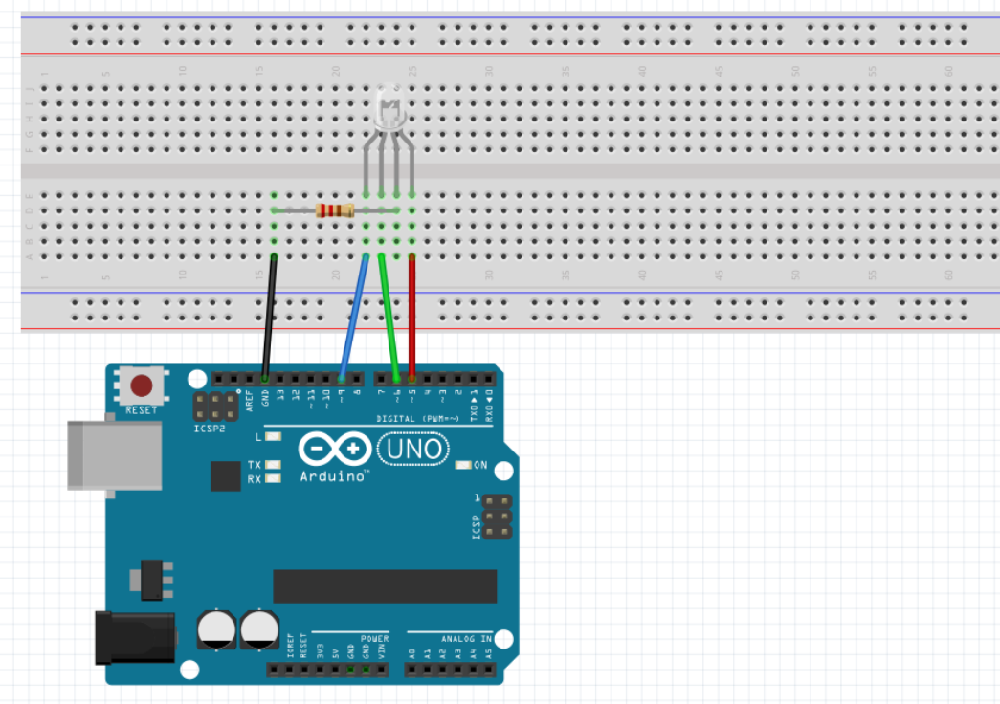

# Proyecto: Semáforo con LEDs

## Descripción:
Simula un semáforo utilizando tres LEDs (rojo, amarillo y verde). Los LEDs se encienden y apagan en secuencia, con retardos definidos para imitar el funcionamiento real de un semáforo, incluye un efecto de "animación de luces" usando más LEDs.

## Componentes Utilizados:
- Arduino.
- LEDs (verde, amarillo, rojo) para el semáforo.
- Resistencias de 220Ω para cada LED.

# Diagrama:
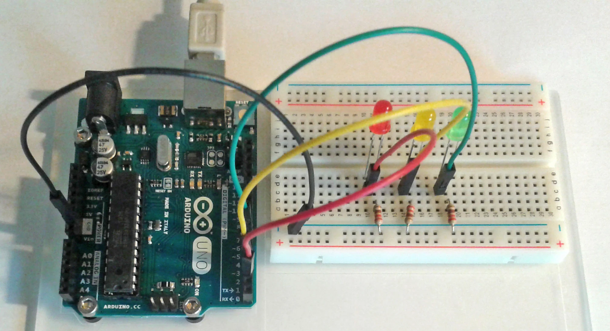

# Proyecto: Pantalla LCD

## Descripción:
Usa un módulo LCD para mostrar el mensaje "Hola Mundo" en la pantalla, se establece el cursor en una posición específica y se muestra el texto estático.

## Componentes Utilizados:
- Arduino.
- Pantalla LCD 16x2 pines (7, 6, 5, 4, 3, 2).
- Potenciómetro para ajustar el contraste (opcional si usas I2C).

# Diagrama:
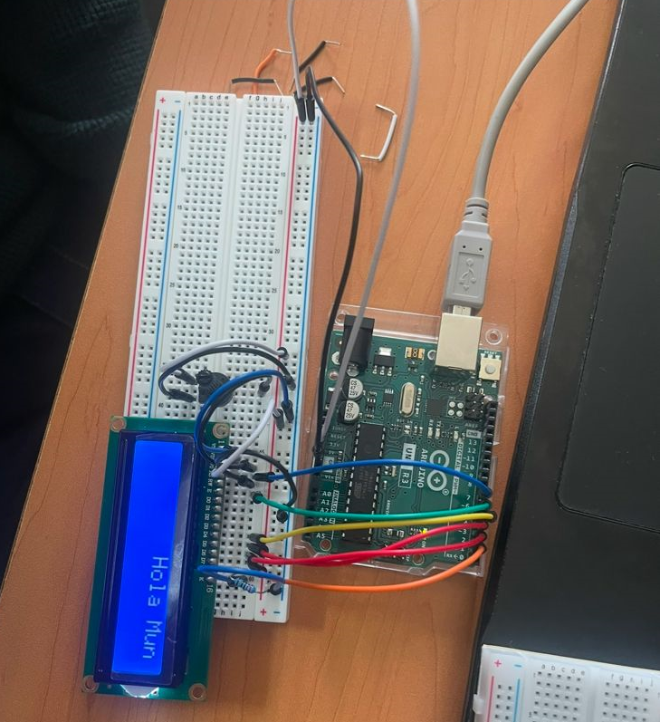

# Proyecto: Sensor Ultrasónico y LCD

## Descripción:
Usa un sensor ultrasónico para medir la distancia a un objeto, los valores se muestran en una pantalla LCD y también se imprimen en el monitor serial, si la distancia es menor o igual a 20 cm, un LED se enciende como señal de alerta.

## Componentes Utilizados:
- Arduino.
- Sensor ultrasónico (trig en pin 10, echo en pin 9).
- Pantalla LCD (pines 7, 6, 5, 4, 3, 2).
- LED conectado al pin 13.

# Diagrama:
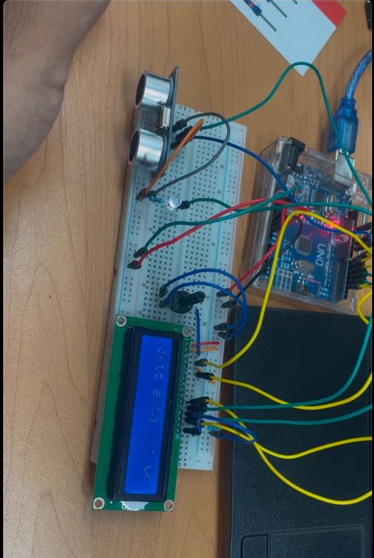

# Proyecto: Sensor Ultrasónico con LEDs y LCD

## Descripción:
Expande la funcionalidad del programa anterior al usar varios LEDs para indicar distancias específicas en intervalos definidos, a medida que el objeto se acerca, más LEDs se encienden.

## Componentes Utilizados:
- Arduino.
- Sensor ultrasónico (trig en pin 10, echo en pin 9).
- Pantalla LCD (pines 7, 6, 5, 4, 3, 2).
- LEDs (6) conectados a los pines 13, 12, 11, A1, A2 y A3.
- Resistencias de 220Ω para cada LED.

# Diagrama:
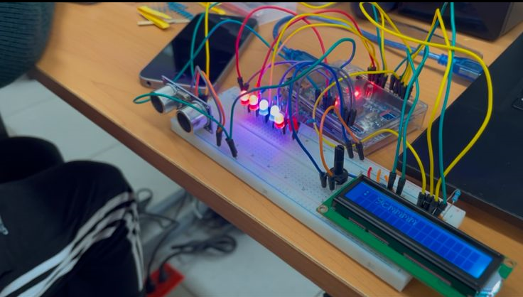

# Proyecto: Sensor de Temperatura y Humedad

## Descripción:
Utiliza un sensor DHT11 para medir la temperatura y humedad del entorno, si la temperatura supera los 28 °C, se enciende un LED, los valores se imprimen en el monitor serial para monitoreo.

## Componentes Utilizados:
- Arduino.
- Sensor DHT11 (pin 2).
- LED conectado al pin 3.
- Resistencia de 220Ω para el LED.

# Diagrama:
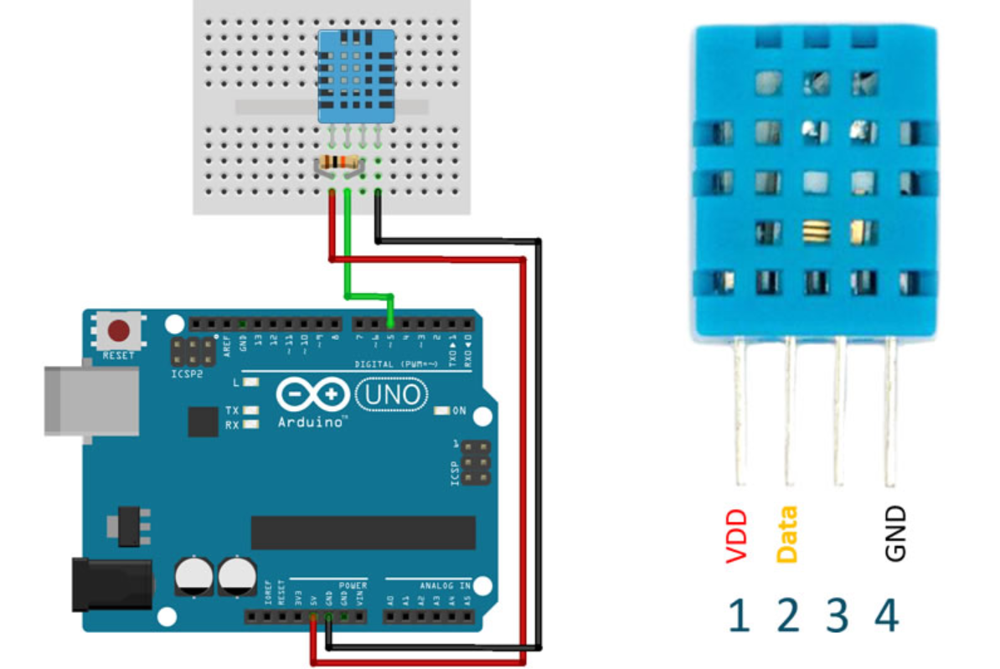

# Proyecto:  Sensor Touch

## Descripción:
Un sensor táctil controla tres LEDs, cada vez que se detecta un toque, los LEDs se alternan encendiéndose uno a la vez en una secuencia cíclica.

## Componentes Utilizados:
- Arduino.
- Sensor táctil capacitivo (pin 7).
- LEDs conectados a los pines 13, 12 y 11.
- Resistencias de 220Ω para cada LED.

# Diagrama:
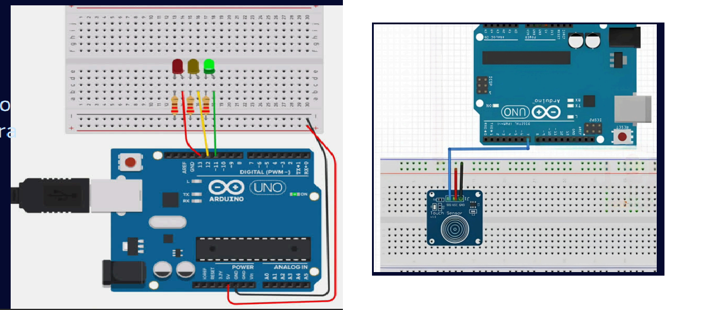

# Proyecto: Joystick

## Descripción:
El programa utiliza un joystick para controlar cuatro LEDs, asignando movimientos en los ejes X e Y del joystick para encender o apagar cada LED, los valores de los ejes se imprimen en el monitor serial para depurar.

## Componentes Utilizados:
- Arduino.
- Joystick analógico (ejes X en A0, Y en A1).
- LEDs conectados a los pines 9, 10, 11 y 12.
- Resistencias de 220Ω para cada LED.

# Diagrama:

# Proyecto: Sensor de Agua

## Descripción:
Este programa utiliza un sensor de agua para detectar el nivel de líquido en un rango de valores analógicos, dependiendo del valor leído, se enciende un LED verde, amarillo o rojo, indicando diferentes niveles de agua, los datos del sensor se imprimen en el monitor serial.

## Componentes Utilizados:
- Arduino.
- Sensor de agua (pin A5).
- LEDs: verde, amarillo, rojo conectados a los pines 8, 9 y 10.
- Resistencias de 220Ω para cada LED.

# Diagrama:
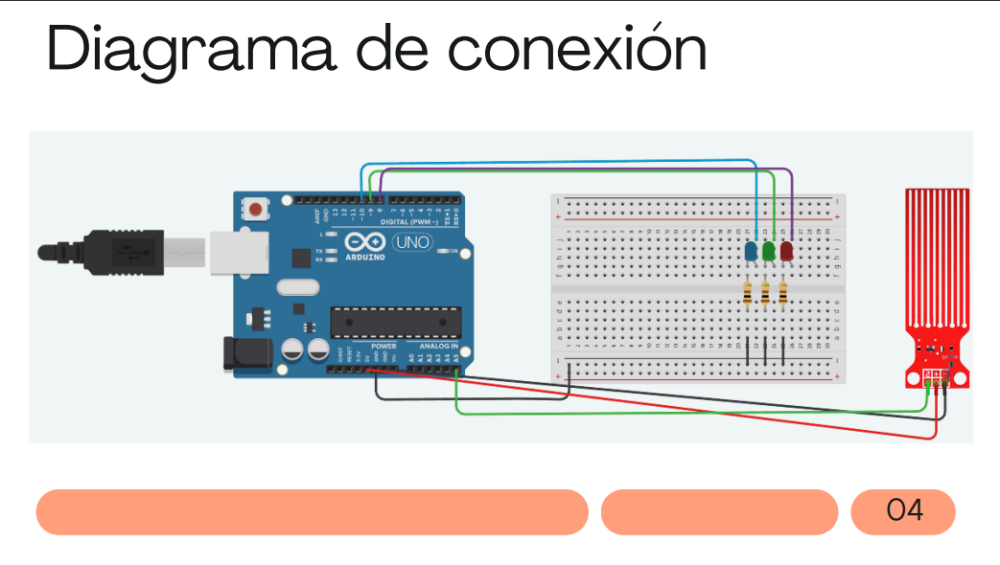

# Proyecto: Sensor de agua con chichara

## Descripción:
Detecta si el suelo está seco o húmedo, enciende un LED si el suelo está húmedo y activa un buzzer si está seco.

## Componentes Utilizados:
- Arduino.
- Sensor de humedad del suelo (pin 9).
- LED conectado al pin 2.
- Buzzer conectado al pin A1.

# Diagrama:
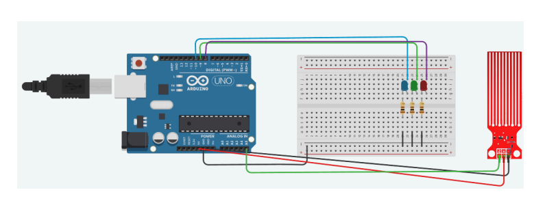

# Proyecto: ServoMotor

## Descripción:
El programa utiliza un sensor ultrasónico para medir distancias y mover un servomotor dependiendo de la proximidad de un objeto, si el objeto está a menos de 10 cm, el servomotor gira a una posición específica.

## Componentes Utilizados:
- Arduino.
- Sensor ultrasónico (trig en pin 2, echo en pin 3).
- Servo motor conectado al pin 4.

# Diagrama:
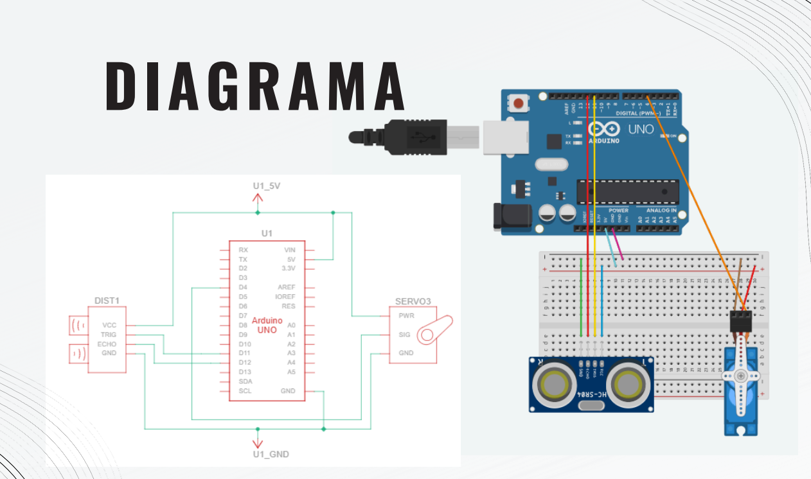
