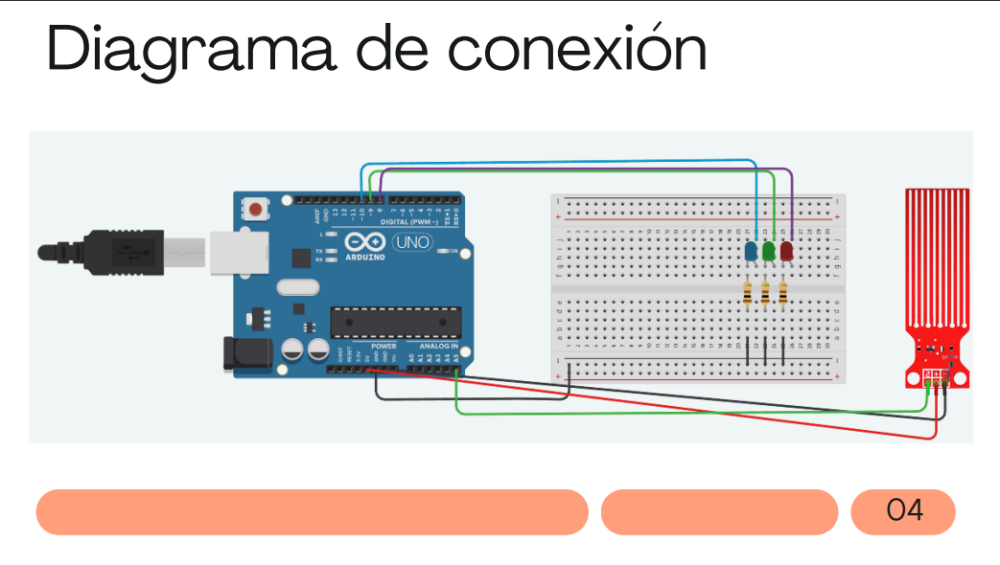

Sistema de Sensor de Agua

Descripción:
Este proyecto utiliza un sensor de agua conectado a al Arduino para monitorear los niveles de agua y activar luces LED según el rango detectado. El sistema proporciona una representación visual del nivel de agua con los siguientes indicadores:

LED Verde: Nivel bajo.

LED Amarillo: Nivel medio.

LED Rojo: Nivel alto.

Componentes Utilizados

1 Arduino (cualquier modelo compatible con entradas/salidas analógicas y digitales).

1 Sensor de agua (con salida analógica).

1 LED Verde.

1 LED Amarillo.

1 LED Rojo.

Resistencias(3).

Cables de conexión.

Conexiones:

Sensor de agua:

Pin de señal conectado al pin analógico A5.

Alimentación y tierra conectados al Arduino.

LEDs:
LED Verde al pin digital 8.
LED Amarillo al pin digital 9.
LED Rojo al pin digital 10.

DIAGRAMA

